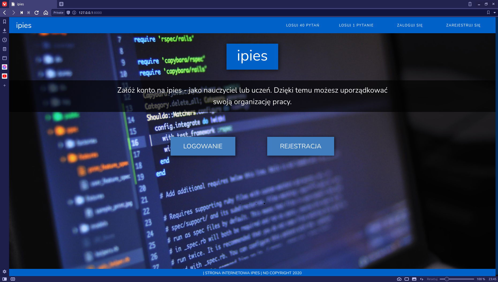
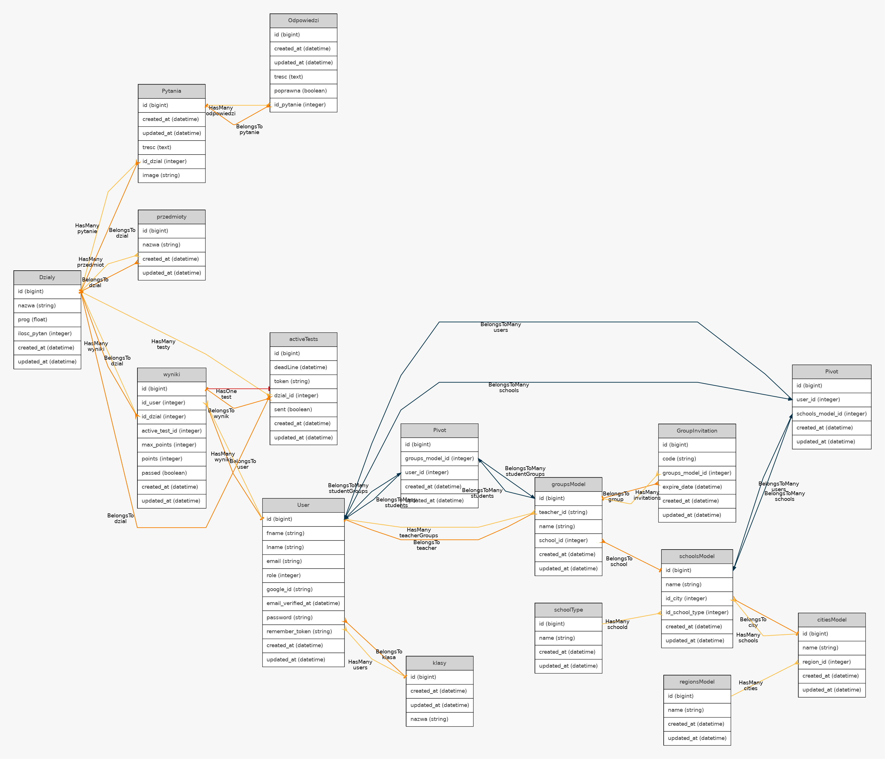

<br>
<br>

<h1>IPIES - dokumentacja techniczna </h1>

## Spis treści

- [Spis treści](#spis-treści)
- [Wprowadzenie](#wprowadzenie)
- [Instalacja i konfiguracja](#instalacja-i-konfiguracja)
  - [Wymagania](#wymagania)
  - [Proces instalacji i konfiguracji ( WSL / Linux)](#proces-instalacji-i-konfiguracji--wsl--linux)
- [](#)
- [Ogólny zarys działania aplikacji](#ogólny-zarys-działania-aplikacji)
  - [Dlaczego SPA?](#dlaczego-spa)
  - [Przykład interakcji między systemami](#przykład-interakcji-między-systemami)
- [Backend](#backend)
  - [Struktura modeli](#struktura-modeli)
    - [Migracje - struktura bazy danych](#migracje---struktura-bazy-danych)
    - [Modele - relacje i pole $fillable](#modele---relacje-i-pole-fillable)
  - [Mapa relacji dla naszego projektu:](#mapa-relacji-dla-naszego-projektu)
  - [Struktura adresów i kontrolerów API](#struktura-adresów-i-kontrolerów-api)
    - [Adresy](#adresy)
    - [Kontrolery](#kontrolery)
- [Frontend](#frontend)
  - [Routing](#routing)
## Wprowadzenie
IPIES jest systemem który pozwala na testowanie wiedzy uczniów. Jest on napisany przy użyciu Vue.js i Laravel-a. 

## Instalacja i konfiguracja

### Wymagania
- Dowolna SQL-owa baza danych (MariaDB, PostgreSQL)
- PHP 7.x
    - php-xml
    - Rozszerzenie wybranej bazy danych ( np.: php-mysql ) 
- Composer 
- npm
- git 
### Proces instalacji i konfiguracji ( WSL / Linux)
1. Klonujemy repozytorium do wybranego folderu  
   ``` bash
   git clone https://github.com/jkarpiu/jakas_strona_do_testow.git  
   cd jakas_strona_do_testow
   ```
2. Instalujemy paczki PHP:
   ``` bash
   composer install
   ```
3. Instalujemy paczki Javascript-a:
   
   ``` bash
   npm install
   ```
4. Kopiujemy domyślny plik .env (plik z informacjami o środowisku)
   
   ``` bash
   cp .env.example .env
   ```
5. Generujemy klucz szyfrowania aplikacji
   ``` bash
   ./artisan key:generate
   ```
6. Podajemy dane naszej bazy danych edytując wybranym edytorem plik .env
    ``` bash
    vi .env
    _________________________________________________
        
        [...]
        
        DB_CONNECTION=mysql // rodzaj (mysql, pgsql, sqlite, sqlsrv)
        DB_HOST=127.0.0.1 // host bazy 
        DB_PORT=3306 // port na którym działa serwer bazy
        DB_DATABASE=nazwa_bazy_danych
        DB_USERNAME=użytkownik
        DB_PASSWORD=hasło
    
        [...]
    ```
7. Wykonujemy migracje 
   ```bash
   ./artisan migrate
   ```
8. Generujemy klucze, które potem będą używane w procesie autoryzacji użytkowników
   ```bash
   ./artisan migrate
   ```
## 
9. Tworzymy dowiązania pozwalające odczytywać pliki potrzebne do działania niektórych elementów strony
    ``` bash
    ./artisan storage:link
    ```
10. Kopiujemy pliki zawierające listę z pytaniami egzaminacyjnymi
    ```
    ```
11. Zapisujemy te pytania oraz podstawowe informacje do bazy
    ```bash
    ./artisan db:seed --class=DzialySeeder
    ./artisan db:seed --class=ee08_seeder //wbrew nazwie to nie tylko ee08
    ./artisan db:seed --class=SchoolSedder
    ```
12. Tworzymy jedną paczkę ze wszystkich napisanych komponentów Vue
    ```bash
    npm run dev
    ```
13. Uruchamiamy serwer 
    ```
    ./artisan serve
    ```
14. Przechodzimy w naszej przeglądarce na adres 127.0.0.1:8000



## Ogólny zarys działania aplikacji 
### Dlaczego SPA?

Nasza aplikacja jest napisana w oparciu o model SPA, co oznacza że cały HTML wczytywany jest tylko raz, reszta danych przesyłanych między przeglądarką, serwerem to tylko czysty JSON. Zaletami takiego rozwiązania  są:  
- skrócenie czasu ładowania poszczególnych podstron
- większa kontrola nad tym co widzi użytkownik 
- mniejsze zużycie np.: danych mobilnych

Rozwiązanie to ma też swoje wady takie jak np.:
- Zwiększony początkowy czas ładowania strony
- dodatkowe czynności podczas wymiany danych


### Przykład interakcji między systemami 

Jako praktyczny przykład działania tego założenia w naszej aplikacji weźmy uruchomienie testu niezadanego przez nauczyciela:
1. Użytkownik klika w "Losuj 40 pytań"
2. Vue router zmienia aktualny widok na komponent testu z odpowiednim parametrem.
3. Komponent wysyłá zapytanie o pytania do API Laravel-a, z danymi dotyczącymi testu
4. Laravel przekierowuje dane z adresu do odpowiedniej funkcji
5. Funkcja sprawdza, czy test jest zadany przez nauczyciela, czy nie. Nasz nie jest więc ustawienia testu są domyślne np.: dla EE.09 mamy 60 min, próg zdania 50 % i wylosowane 40 pytań
6. Tworzona jest sesja testu w tabeli activeTests, ma ona swój unikalny klucz i tam także zapisany jest "deadline" naszego testu.
7. Laravel losuje 40 pytań z bazy.
8. Funkcja zwraca jako odpowiedź treść, id pytań odpowiedzi (bez informacji która jest poprawna) oraz informacje o sesji testu.
9. Vue wyświetla pobrane pytania do rozwiązania oraz zapisuje do zmiennej informacje o sesji.
10. Po rozwiązaniu testu Vue wysyła listę zaznaczonych odpowiedzi do innego adresu api, a Laravel jeżeli wszystko się zgadza zwraca do Vue wyniki oraz listę poprawnych odpowiedzi. 
11. Vue wyświetla pobrane dane.

## Backend
### Struktura modeli

#### Migracje - struktura bazy danych

Pliki definiujące strukturę bazy danych można znaleźć w folderze database / migrations 
```
migrations
├── 2014_10_12_000000_create_users_table.php
├── 2014_10_12_100000_create_password_resets_table.php
├── 2019_08_19_000000_create_failed_jobs_table.php
├── 2020_11_16_123051_create_przedmioties_table.php
├── 2020_11_16_152658_create_klasies_table.php
├── 2020_11_16_153352_create_pytanias_table.php
├── 2020_11_16_155033_create_odpowiedzis_table.php
├── 2020_11_16_162705_create_dzialies_table.php
├── 2020_11_16_184600_create_wynikis_table.php
├── 2020_11_20_225022_create_groups_models_table.php
├── 2020_11_20_225136_create_schools_models_table.php
├── 2020_11_20_225147_create_cities_models_table.php
├── 2020_11_21_191436_create_active_tests_table.php
├── 2020_11_25_193907_create_regions_models_table.php
├── 2020_11_25_194125_create_school_types_table.php
├── 2020_11_25_200305_create_schools_models_users_table.php
├── 2020_12_04_230933_create_groups_model_user_table.php
├── 2020_12_04_232610_create_group_invitations_table.php
├── 2020_12_05_153040_create_group_posts_table.php
├── 2020_12_05_153216_create_group_attachments_table.php
├── 2020_12_05_153902_create_attachment_types_table.php
├── 2020_12_06_113646_create_teacher_tests_table.php
├── 2020_12_06_114333_create_users_teacher_tests_table.php
└── 2020_12_07_131419_create_comments_table.php
```

Każdy z tych plików ma raczej podobną strukturę, najważniejszą częścią jest funkcja up(). Zawiera ona definicje kolumn danej tabeli np.: w pliku comments_table.php

```php
Schema::create('comments', function (Blueprint $table) {
    $table->id();
    $table->timestamps();
    $table->longtext('tresc');
    $table->integer('group_post_id');
    $table->integer('user_id');
});
```
Na przykładzie 4 linijki możemy zobaczyć że tworzona jest kolumna o nazwie treść i typie longText. 
Konwencja w Laravel-u mówi że kolumna zawierająca klucz obcy powinna mieć nazwę składającą się z nazwy tabeli do której ten klucz się odnosi i słówka id. Całość zapisana ma być w notacji węgierskiej. Relacje same w sobie definiowane są w plikach modeli, ale to w większych szczegółach opisane jest poniżej.
Oprócz tego możemy tu także zobaczyć dwie funkcje nie przyjmujące parametru: id oraz timestamps. Funkcja id definiuje klucz podstawowy z domyślnymi SQL-ymi parametrami (AUTO-INCREMENT i UNIQUE), a timestamps dodaje dwa pola, jedno z datą utworzenia rekordu, a drugie z datą ostatniej edycji.

#### Modele - relacje i pole $fillable

W głównym folderze app możemy znaleźć pliki odpowiedzialne za definicje relacji i innych rzeczy związanych z odnoszeniem się do bazy danych w kodze

```bash
app
├── activeTests.php
├── attachmentType.php
├── citiesModel.php
├── comments.php
├── Dzialy.php
├── groupAttachment.php
├── GroupInvitation.php
├── groupPost.php
├── groupsModel.php
├── Odpowiedzi.php
├── przedmioty.php
├── Pytania.php
├── regionsModel.php
├── schoolsModel.php
├── schoolType.php
├── teacherTest.php
├── User.php
└── wyniki.php
```
W każdym z tych plików znajdziemy mniej więcej podobną strukturę z główną klasą definiującą model w niej np.: w pliku groupPost.php

```php
protected $fillable = ['author_id', 'groups_model_id', 'content', 'title', 'active'];

public function comments(){
    return $this->hasMany(comments::class);
}
public function group () {
    return $this -> belongsTo(groupsModel::class );
}
```
Zmienna $fillable definiuje tutaj pola, które możemy 'wypełniać' z poziomu samej aplikacji. a funkcje definiują tutaj nasze relację. 

### Mapa relacji dla naszego projektu:



Możemy tutaj zobaczyć że np.: model użytkownika potrafi być połączony z modelem grup kilkoma relacjami. Wynika to z tego że użytkownik może być zarówno nauczycielem jak i uczniem, ale tylko nauczyciele mogą 'administratorami' grupy, i tylko uczniowie mogą być jej członkami (przynajmniej na chwile obecną).

### Struktura adresów i kontrolerów API

#### Adresy
Adresy ap zdefiniowane są w pliku /routes/api.php możemy tam zobaczyć że każdy z zdefiniowanych adresów ma mniej więcej podobną budowę:
 ``` php
Route::get('miasta', 'basicServicesController@miasta');
 ```
w której to po słówku route definiowany jest rodzaj akcji ( post / get),
później w nawiasach zobaczymy adres oraz kontroler i funkcje do jakiej się odwołujemy.
Możemy też zobaczyć że niektóre z funkcji mają middleware 'auth.api'. Nie pozwala on niezalogowanym użytkownikom na dostęp do danej części aplikacji, a później w kontrolerze daje nam dostęp do obiektu z danymi zalogowanego użytkownika.

#### Kontrolery
Pliki zawierające większość naszych kontrolerów możemy znaleźć w folderze /app/Htpp/controllers. Znajdują się tam następujące pliki: 

```bash
app/Http/controllers
├── addQuestionController.php
├── AuthController.php
├── basicServicesController.php
├── CommentsController.php
├── Controller.php
├── groupsController.php
├── HomeController.php
├── randQuestionController.php
├── SpaController.php
├── testsController.php
└── userController.php
```

Weźmy za przykład plik basicServicesController.php. Na początku pliku zdefiniowany jest namespace dla kontrolerów, później do naszego pliku importujemy potrzebne modele oraz dodatkowe paczki, modele mają przedrostek App\ np.:
```php 
use App\citiesModel;
```
importuje model miast do naszego pliku. 

Poniżej zdefiniowana jest klasa naszego kontrolera, a w niej poszczególne metody do których odnosimy się w pliku routes/api.php
Np: funkcja miasta:
```php
public function miasta(Request $request)
    {
        return response()->json(
            regionsModel::with('cities')->find($request['id'])->cities
        );
    }
```
Przyjmuje parametr $request, który jest obiektem zawierającym wszystkie dane wysłane do danej ścieżki dowolną metodą ( np.: post, get ).
Dalej funkcja ta zwraca odpowiedź w formacie json, w której to zawarte są wszystkie miasta, w danym regionie o danym id. W podobny sposób działą większość naszych kontrolerów, jednak zwykle mają więcej 'ciekawej logiki' związanej z czasem, czy użytkownikiem.

## Frontend

### Routing
Routing-iem w naszej aplikacji zajmuje się Vue-Router.
Wszystkie możliwe adresy 'webowe' dostępne są w zmiennej stałej routes znajdującej się w pliku resources/js/app.js. 
Weźmy za przykład adres losowanie40
```javascript
{
    path: '/losowanie40',
    name: 'losowanie40',
    component: Pytanka,
    props: { ilosc: 40 }
},
```

Atrybuty path i name raczej nie wymagają wyjaśnienia. Atrybut component określa jaki komponent będzie głównym komponentem tego adresu, a props definiuje zmienne jakie chcemy podać temu komponentowi. Komponenty są importowane na górze pliku ( więcej o komponentach poniżej ).
Głównym komponentem w środku którego wyświetlane są inne komponenty jest app, zdefiniowano to w stałej router. 
