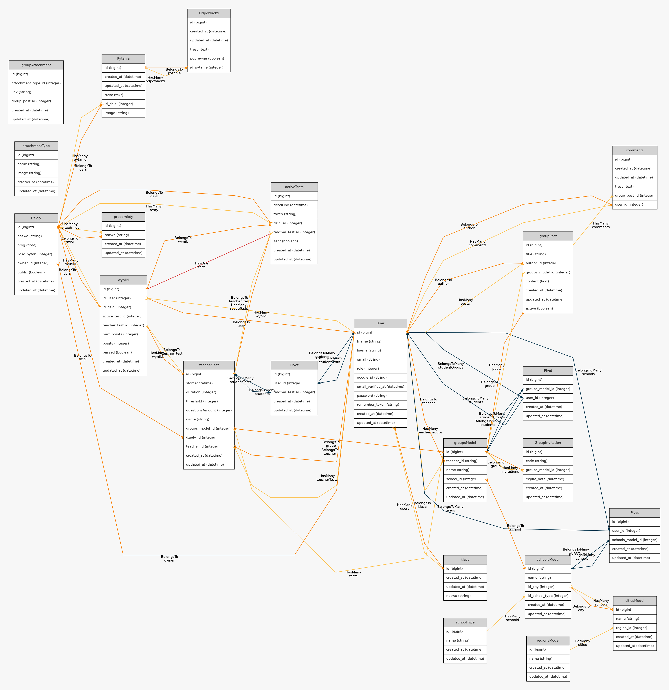

<br>
<br>

<h1>IPIES - dokuemntacja techniczna </h1>


## Wprowadzenie
IPIES jest systemem który pozwala na testowanie wiedzy uczniów. Jest on napisany przy użyciu Vue.js i Laravela. 

## Instalacja 

### Wymagania
- Dowonlna SQL-owa baza danych (MariaDB, PostgreSQL)
- PHP 7.x
    - php-xml
    - Rozszerzenie wybranej bazy danych ( np.: php-mysql ) 
- Composer 
- npm
- git 
### Proces instalacji ( WSL / Linux)
1. Klonujemy repozytorium do wybranego folderu  
   ``` bash
   git clone https://github.com/jkarpiu/jakas_strona_do_testow.git  
   cd jakas_strona_do_testow
   ```
2. Instalujemy paczki PHP:
   ``` bash
   composer install
   ```
3. Instalujemy paczki Javascripta:
   
   ``` bash
   npm install
   ```
4. Kopiujemy domyślny plik .env (plik z informacjami o środowisku)
   
   ``` bash
   cp .env.example .env
   ```
5. Generujemy klucz szyfrowania aplikacji
   ``` bash
   ./artisan key:generate
   ```
6. Podajemy dane naszej bazy danych edytując wybranym edytorem plik .env
    ``` bash
    vi .env
    _________________________________________________
        
        [...]
        
        DB_CONNECTION=mysql // rodzaj (mysql, pgsql, sqlite, sqlsrv)
        DB_HOST=127.0.0.1 // host bazy 
        DB_PORT=3306 // port na którym działa serwer bazy
        DB_DATABASE=nazwa_bazy_danych
        DB_USERNAME=użytkownik
        DB_PASSWORD=hasło
    
        [...]
    ```
7. Wykonujemy migracje 
   ```bash
   ./artisan migrate
   ```
8. Generujemy klucze, które potem bedą używane w procesie autoryzacji użytkowników
   ```bash
   ./artisan migrate
   ```
## 
9. Tworzymy dowiązania pozwalające odczytywać pliki potrzebne do działania niektórych elementów strony
    ``` bash
    ./artisan storage:link
    ```
10. Kopiujemy pliki zawierające liste z pytaniami egzaminacyjnymi
    ```
    ```
11. Zapisujemy te pytania oraz podstawowe informacje do bazy
    ```bash
    ./artisan db:seed --class=DzialySeeder
    ./artisan db:seed --class=ee08_seeder //wbrew nazwie to nie tylko ee08
    ./artisan db:seed --class=SchoolSedder
    ```
12. Tworzymy jedną paczkę ze wsyztskich napisanych kompentów Vue
    ```bash
    npm run dev
    ```
13. Uruchamiamy serwer 
    ```
    ./artisan serve
    ```
14. Przechodzimy w naszej przeglądarce na adres 127.0.0.1:8000


## Struktura modeli

### Migracje - struktura bazy danych

Pliki definiujące strukture bazy danych można znaleźć w folderze database / migrations 
```
migrations
├── 2014_10_12_000000_create_users_table.php
├── 2014_10_12_100000_create_password_resets_table.php
├── 2019_08_19_000000_create_failed_jobs_table.php
├── 2020_11_16_123051_create_przedmioties_table.php
├── 2020_11_16_152658_create_klasies_table.php
├── 2020_11_16_153352_create_pytanias_table.php
├── 2020_11_16_155033_create_odpowiedzis_table.php
├── 2020_11_16_162705_create_dzialies_table.php
├── 2020_11_16_184600_create_wynikis_table.php
├── 2020_11_20_225022_create_groups_models_table.php
├── 2020_11_20_225136_create_schools_models_table.php
├── 2020_11_20_225147_create_cities_models_table.php
├── 2020_11_21_191436_create_active_tests_table.php
├── 2020_11_25_193907_create_regions_models_table.php
├── 2020_11_25_194125_create_school_types_table.php
├── 2020_11_25_200305_create_schools_models_users_table.php
├── 2020_12_04_230933_create_groups_model_user_table.php
├── 2020_12_04_232610_create_group_invitations_table.php
├── 2020_12_05_153040_create_group_posts_table.php
├── 2020_12_05_153216_create_group_attachments_table.php
├── 2020_12_05_153902_create_attachment_types_table.php
├── 2020_12_06_113646_create_teacher_tests_table.php
├── 2020_12_06_114333_create_users_teacher_tests_table.php
└── 2020_12_07_131419_create_comments_table.php
```

Każdy z tych plików ma raczej podobną strukture, najważniejszą częscią jest funkcja up(). Zawiera ona definicje kolumn danej tabeli np.: w pliku comments_table.php

```php
Schema::create('comments', function (Blueprint $table) {
    $table->id();
    $table->timestamps();
    $table->longtext('tresc');
    $table->integer('group_post_id');
    $table->integer('user_id');
});
```
Na przykładzie 4 linijki możemy zobaczyć że tworzona jest kolumna o nazwie treść i typie longText. 
Konwencja w Laravelu mówi że kolumna zawierająca klucz obcy powinna mieć nazwę składającą się z nazwy tabeli do której ten klucz się odnosi i słówka id. Całośc zapisana ma być w notacji węgierskiej. Relacje same w sobie definiowane są w plikach modeli, ale to w większych szczęgółach opisane jest poniżej.
Opróćz tego możemy tu także zobaczyć dwie funckje nie przyjmujące parametru: id oraz timestamps. Funkcja id definiuje klucz podstawowy z domyślnymi SQL-wymi parametrami (AUTO-INCREMENT i UNIQUE), a timestamps dodaje dwa pola, jedno z datą utworzenia rekordu, a drugie z datą ostatniej edycii.

### Modele - realacje i pole $fillable

W głównym folderze app możemy znależć pliki odpowiedzialne za definicje relacji i innych rzeczy związanych z odnoszeniem się do bazy danych w kodze

```bash
app
├── activeTests.php
├── attachmentType.php
├── citiesModel.php
├── comments.php
├── Dzialy.php
├── groupAttachment.php
├── GroupInvitation.php
├── groupPost.php
├── groupsModel.php
├── Odpowiedzi.php
├── przedmioty.php
├── Pytania.php
├── regionsModel.php
├── schoolsModel.php
├── schoolType.php
├── teacherTest.php
├── User.php
└── wyniki.php
```
W każdym z tych plików znajdziemy mniej więcej podobną strukture z główną klasą definiującą model w niej np.: w pliku groupPost.php

```php
protected $fillable = ['author_id', 'groups_model_id', 'content', 'title', 'active'];

public function comments(){
    return $this->hasMany(comments::class);
}
public function group () {
    return $this -> belongsTo(groupsModel::class );
}
```
Zmienna $fillable definiuje tutaj pola, które możemy 'wypełniać' z poziomu samej aplikacji. a funkcje definiują tutaj nasze relację. 

### Mapa relacji dla naszego projektu:


Możemy tutaj zobaczyć że np.:
